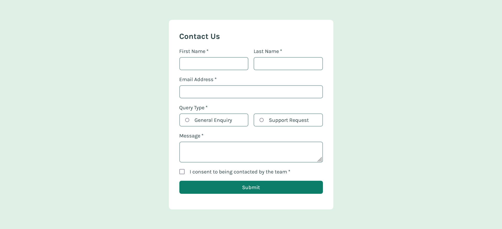

# Frontend Mentor - Contact form solution

## Overview

### The challenge

Users should be able to:

- Complete the form and see a success toast message upon successful submission
- Receive form validation messages if:
  - A required field has been missed
  - The email address is not formatted correctly
- Complete the form only using their keyboard
- Have inputs, error messages, and the success message announced on their screen reader
- View the optimal layout for the interface depending on their device's screen size
- See hover and focus states for all interactive elements on the page

### Screenshot

### Links

- Solution URL: [Github](https://github.com/Shahzaib-ur-Rehman/contact-form)
- Live Site URL: [Contact Form](https://contact-form-5zggbeeb4-shahzaiburrehmans-projects.vercel.app/)

## My process

### Built with

- Semantic HTML5 markup
- CSS custom properties
- Flexbox
- CSS Grid
- Mobile-first workflow
- [React](https://reactjs.org/) - JS library
- [Next.js](https://nextjs.org/) - React framework

## Author

- Website - [Shahzaib ur Rehman](https://www.linkedin.com/in/shahzaib-ur-rehman-2518b01b8/)
- Frontend Mentor - [@Shahzaib-ur-Rehman](https://www.frontendmentor.io/profile/Shahzaib-ur-Rehman)
